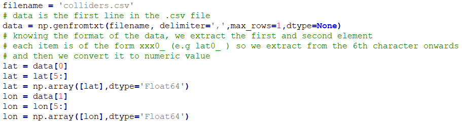
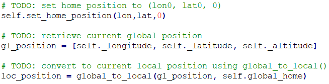
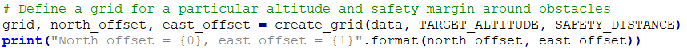
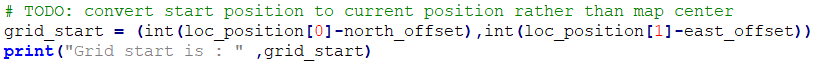
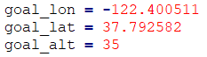
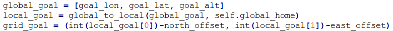
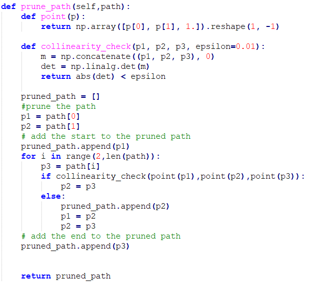
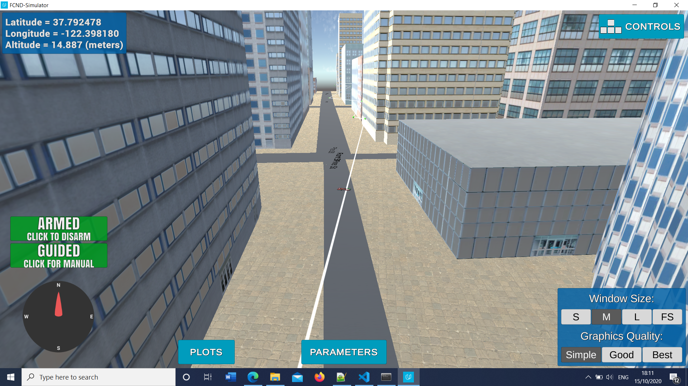

## Project: 3D Motion Planning

### Starter Code
These scripts contain a basic planning implementation that includes the drone path planning algorithm and the necessary transition and callback functions.
The motion_planning.py file is basically what is needed to plan the path of the drone. We have the definition of the class.
The class, as before, contains the callback functions and the state transitions.
The plan_path is the main function where the algorithm takes place.
The planning_utils.py contains the function to create the 2.5D grid based on the data and the parameters of altitude and safety distance.
It also contains the heart of the path finding algorithm on the grid, which is the A* algorithm.

### Implementation

#### 1. Set global position
First we have to set the global position. We do this by first extracting the first line from the .csv file.

#### 2. Set your current local position
Then we use the function provided by the Drone class set_home_position.
After that, we use the global_to_local function with arguments the global position of the drone and the global home location.

#### 3. Set grid start position from local position
As a first step, we create the grid (step already implemented)

Then, we set the grid start

#### 4. Set grid goal position from geodetic coords
As a next step, we need to define the local goal position based on the global position.
We first select the global coordinates, for example:

Then we need to convert that to a local position. We do that using the global_to_local function.

#### 5. Modify A* to include diagonal motion (or replace A* altogether)
We modify the A* algorithm adding diagonal movements with a sqrt(2) cost.
First I added the NORTHWEST, SOUTHWEST, SOUTHEAST, NORTHEAST tuples in the Action class.
Then, in the valid actions, according to wether we go out of grid or crash on an obtsacle, we remove the actions containing that direction.

#### 6. Cull waypoints
We define a function to prune the path keeping our code tidy.
We start with an empty list and we only add the start point. Then for every next iteration, we consider 3 consecutive points.
The function uses a collinearity check based on the determinant of the points (from the linear algebra package).
Each time we have 3 points. If determinant signifies collinear points, then we ignore the second (intermediate) point and continue with the next points.
If they are not collinear, then we have to add the intermediate point to the list.

#### The drone in action below

